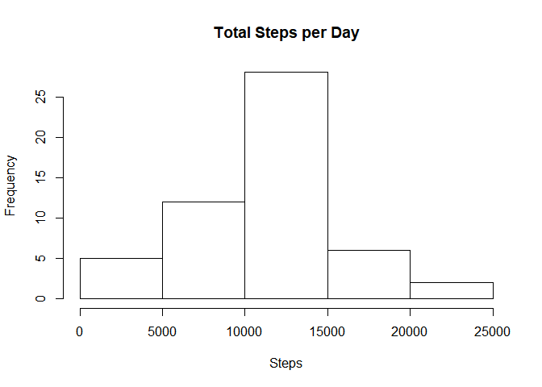
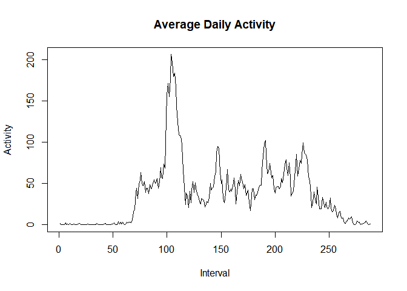
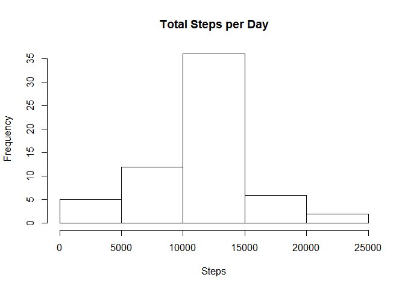
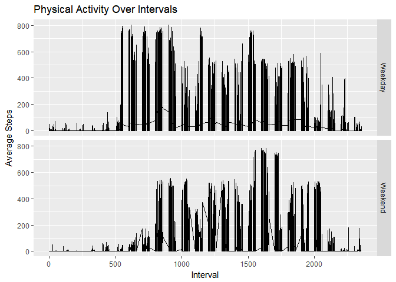

## Overview

This report makes use of data from a personal activity monitoring device. This device collects data at 5 minute intervals through out the day. The data consists of two months of data from an anonymous individual collected during the months of October and November, 2012 and include the number of steps taken in 5 minute intervals each day.

The variables included in this dataset are:

- steps: Number of steps taking in a 5-minute interval (missing values are coded as NA)
- date: The date on which the measurement was taken in YYYY-MM-DD format
- interval: Identifier for the 5-minute interval in which measurement was taken


```r
library(dplyr)
```

```
## 
## Attaching package: 'dplyr'
```

```
## The following objects are masked from 'package:stats':
## 
##     filter, lag
```

```
## The following objects are masked from 'package:base':
## 
##     intersect, setdiff, setequal, union
```

```r
library(ggplot2)
```

```
## Warning: package 'ggplot2' was built under R version 3.4.2
```

```r
ad<- read.csv("activity.csv")
```
##Summary
The dataset is loaded from a comma-separated-value (CSV) file and there are a total of 17,568 observations in this dataset as we show below. We convert date to date format for ease of analysis.

```r
str(ad)
```

```
## 'data.frame':	17568 obs. of  3 variables:
##  $ steps   : int  NA NA NA NA NA NA NA NA NA NA ...
##  $ date    : Factor w/ 61 levels "2012-10-01","2012-10-02",..: 1 1 1 1 1 1 1 1 1 1 ...
##  $ interval: int  0 5 10 15 20 25 30 35 40 45 ...
```

```r
ad$date<-as.Date(ad$date, "%Y-%m-%d")
```
##Sum, Mean, Median of steps taken per day
Here's a distribution of total steps taken each day.

```r
adsumd<- aggregate(steps~date, data=ad, sum, na.rm=T)
hist(adsumd$steps, main="Total Steps per Day", xlab="Steps", ylab="Frequency")
```

<!-- -->
The mean and median of the total steps each day data are given below:

```r
cat("mean: ", mean(adsumd$steps))
```

```
## mean:  10766.19
```

```r
cat("median: ", median(adsumd$steps))
```

```
## median:  10765
```
##Average Interval Activity Pattern
Here we study a time series over 5 minute intervals across all days.


```r
adi<- aggregate(steps~interval, data=ad, mean, na.rm=T)
plot(adi$steps, type='l', main="Average Daily Activity", xlab="Interval", ylab="Activity")
```

<!-- -->
Here we find the interval with the highest activity.

```r
cat("Max Activity Interval: ", adi$interval[which(adi$steps==max(adi$steps))] )
```

```
## Max Activity Interval:  835
```

##Missing Values, New Data
Here we find the number of missing values.

```r
adna<-which(is.na(ad$steps))
cat("Missing values count: ", length(adna))
```

```
## Missing values count:  2304
```
Here we create a new dataset by filling the NA values with the average number of steps for the same interval.

```r
adnew<-ad
for(i in 1:nrow(ad)) {
  if(is.na(adnew$steps[i])) {
    adnew$steps[i]<-adi$steps[which(adi$interval==adnew$interval[i])]
    
  }}
```
We plot the total steps per day histogram again with the NA values replaced.

```r
adsumd<- aggregate(steps~date, data=adnew, sum, na.rm=T)
hist(adsumd$steps, main="Total Steps per Day", xlab="Steps", ylab="Frequency")
```

<!-- -->
The new mean and median are calculated below

```r
cat("mean: ", mean(adsumd$steps))
```

```
## mean:  10766.19
```

```r
cat("median: ", median(adsumd$steps))
```

```
## median:  10766.19
```
##Weekdays vs. Weekends
Now we add a column that stores which day of the week each date represents. This column is then overwritten by weekday or weekend as a factor. We plot a time series for average number of steps taken over each interval, comparing between weekdays and weekends. 

```r
adnew$day<- weekdays(adnew$date)
wd<- c("Monday", "Tuesday", "Wednesday", "Thursday", "Friday")
for(i in 1:nrow(adnew)){
  if(adnew$day[i] %in% wd ) adnew$day[i]="Weekday"
  else adnew$day[i]="Weekend"
}

plot1 <- ggplot(data=adnew, aes(x=interval, y=steps))+
         geom_line()+
         facet_grid(day~.)+
         labs(x="Interval", y="Average Steps")+
         ggtitle("Physical Activity Over Intervals")
print(plot1)
```

<!-- -->
